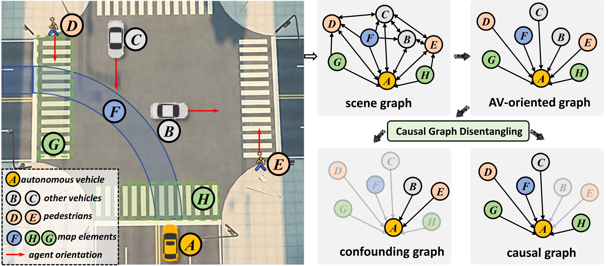
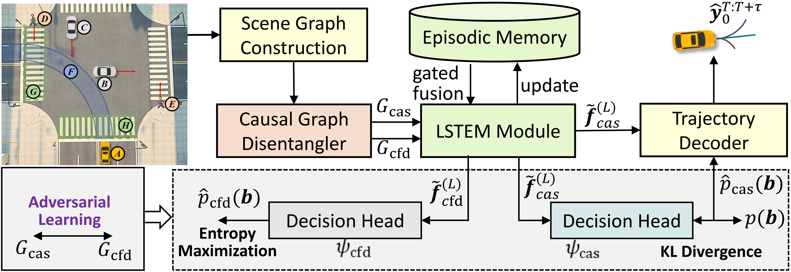
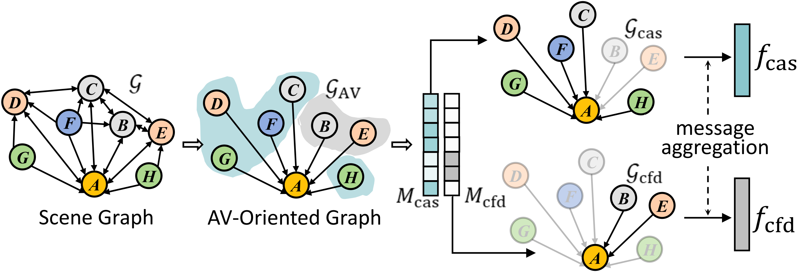
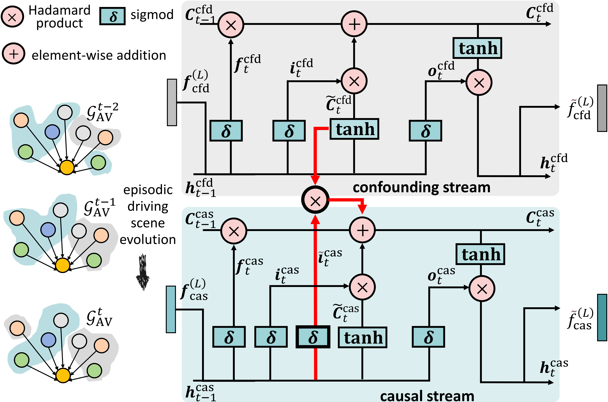

<h1 align="center"> Causal-Planner: Causal Interaction Disentangling with Episodic Memory Gating for Autonomous Planning </h1> 

> - Yibo Yuan, Jianwu Fang, Yang Zhou, Zhao Yang, Chen Lv, Jianru Xue
> - If you have any questions, please feel free to contact: *Yibo Yuan* (Yyb_XJTU@stu.xjtu.edu.cn)

<!-- <div id="top" align="center">
<p align="center">

</p>
</div> -->

<div style="display: flex; justify-content: center; align-items: center; gap: 2%;">

  

  

  

  

</div>


## TODO List
Our paper has been accepted, and the code and checkpoints will be released gradually.
- [x] Initial release
- [ ] Training code
- [ ] Pretrained checkpoints

## Table of Contents

- [Methods](#methods)
- [Experiments on nuPlan](#experiments-on-nuplan)
    - [Quantitative Results](#quantitative-results)
    - [Qualitative Results](#qualitative-results)
- [Getting Started](#getting-started)
    - [Installation](#installation)
    - [Training](#training)
    - [Evaluation](#evaluation)


## Methods

**Causal-Planner** leverages a Causal Graph Disentangler (CGD) module with adversarial attention to disentangle ego-critical causal interactions from scene confounders, and a Long-Short-Term Episodic Memory Gating (LSTEM) module to capture evolving causal dynamics through bidirectional temporal fusion in autonomous driving:
- Causal Graph Disentangler (CGD): Adversarially disentangles causal-confounding interactions by learning adversarial attention masks that suppress confounding factors.
- Long-Short-Term Episodic Memory Gating (LSTEM): Fuses historical causal patterns and real-time interactions through bidirectional gated LSTM, capturing evolving causal dynamics.


<div id="top" align="center">
<p align="center">

</p>
</div>

**CGD**: Dynamically isolates causal interactions via adversarial attention masks.

<div id="top" align="center">
<p align="center">

</p>
</div>

**LSTEM**: Models temporal causal evolution through bidirectional memory fusion.

<div id="top" align="center">
<p align="center">

</p>
</div>

## Experiments on nuPlan

###  Quantitative Results

| Method                        | Test14-random CLS-NR↑ | Test14-random CLS↑ | Test14-random OLS↑ | Test14-hard CLS-NR↑ | Test14-hard CLS↑ | Test14-hard OLS↑ |
|-------------------------------|-----------------------|--------------------|--------------------|---------------------|------------------|------------------|
|Human Expert              | 0.940                 | 0.759              | 1.000              | 0.860               | 0.688            | 1.000            |
| PDM-Open                      | 0.528                 | 0.572              | 0.841              | 0.335               | 0.358            | 0.791            |
| UrbanDriver                   | 0.633                 | 0.610              | 0.824              | 0.515               | 0.491            | 0.769            |
| PlanTF                        | 0.871                 | 0.764              | 0.883          | 0.726               | 0.603            | 0.837            |
| PLUTO*                        | 0.893                 | 0.765              | 0.880              | 0.685               | 0.559            | 0.793            |
| PlanScope                     | 0.905             | 0.746              | 0.883          | 0.715               | 0.553            | 0.805            |
| BeTopNet                      | 0.902                 | **0.857**          | 0.876              | **0.771**           | 0.688        | 0.840        |
| Diffusion Planner*            | 0.892                 | 0.829              | -                  | 0.760               | **0.692**        | -                |
| **Causal-planner (Ours)**         | **0.906**             | 0.842          | **0.895**          | 0.768           | **0.692**        | **0.867**        |

The symbol * indicates the baseline configuration without post-processing refinement. (All our models are purely learning-based, without any post-processing.)

---

###  Qualitative Results
<div id="top" align="center">
<p align="center">

</p>
</div>
We compare our Causal-planner with four SOTA models (from left to right: PlanTF, PLUTO*, PlanScope, and Diffusion Planner*) in the left turning scenarios of Test14-hard across three kinds of intersections.

## Getting Started
#### Installation
- Setup the nuPlan dataset following the [offiical-doc](https://nuplan-devkit.readthedocs.io/en/latest/dataset_setup.html)
- Setup conda environment
```
conda create -n diffusion_planner python=3.9
conda activate diffusion_planner

# install nuplan-devkit
git clone https://github.com/motional/nuplan-devkit.git && cd nuplan-devkit
pip install -e .
pip install -r requirements.txt
```
### Training
```bash
./script/train/train_causal.sh
```

### Evaluation

```bash
# Evaluation of the CLS-NR Metric
./script/sim/causal/sim_causal_CLN.sh
# Evaluation of the CLS Metric
./script/sim/causal/sim_causal_CLR.sh
# Evaluation of the OLS Metric
./script/sim/causal/sim_causal_OL.sh
```


## Acknowledgement
Causal-Planner is greatly inspired by the following outstanding contributions to the open-source community:
[nuplan-devkit](https://github.com/motional/nuplan-devkit), [planTF](https://github.com/jchengai/planTF), [HDGT](https://github.com/OpenDriveLab/HDGT), [DEMO](https://github.com/fudan-zvg/DeMo), [PLUTO](https://github.com/jchengai/pluto), [PlanScope](https://github.com/Rex-sys-hk/PlanScope)
